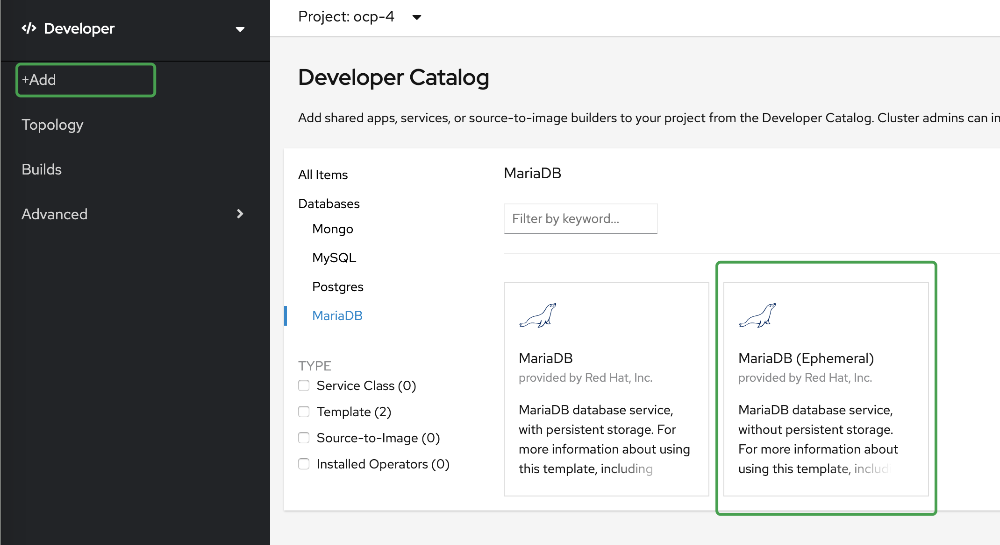

# exercise-3

### 创建数据库

新建数据库：




填写数据库配置信息：


连接上数据库，使用下列建表语句创建 t_user 表结构

```shell
CREATE TABLE `t_user` (
  `id` bigint(20) NOT NULL AUTO_INCREMENT,
  `name` varchar(255) DEFAULT NULL,
  PRIMARY KEY (`id`)
) ENGINE=InnoDB DEFAULT CHARSET=utf8;

```

### 配置数据库和应用关联应用集合

找到应用的的lable添加到修改数据DC的label中。


### s2i部署应用

克隆 https://github.ibm.com/ocp-lang/exercise-3  代码。

pom.xml文件添加如下配置：

```xml
<dependency>
  <groupId>org.springframework.boot</groupId>
  <artifactId>spring-boot-starter-data-jpa</artifactId>
</dependency>
<dependency>
  <groupId>mysql</groupId>
  <artifactId>mysql-connector-java</artifactId>
  <scope>runtime</scope>
</dependency>
```

新建 UserRepository.java 文件

```java
package com.xcxu.ocpdemo.repository;

import com.xcxu.ocpdemo.entity.User;
import org.springframework.data.jpa.repository.JpaRepository;

public interface UserRepository extends JpaRepository<User, Long> {
  User findByName(String emailAddress);
}
```

新建 User.java 文件

```java
package com.xcxu.ocpdemo.entity;

import javax.persistence.*;

@Entity(name = "t_user")
public class User {
    @Id
    @GeneratedValue(strategy = GenerationType.IDENTITY)
    private Long id;
    @Column
    private String name;

    public Long getId() {
        return id;
    }

    public void setId(Long id) {
        this.id = id;
    }

    public String getName() {
        return name;
    }

    public void setName(String name) {
        this.name = name;
    }
}

```

修改application.xml文件

```yaml
spring:
  profiles:
    active: local
---
spring:
  profiles: local
  application:
    name: ocpexample

  datasource:
    url: jdbc:mysql://localhost:3306/chengdb
    username: root
    password: root

  server:
    port: 8080
---
spring:
  profiles: ocp
  application:
    name: ocpexample

  datasource:
    url: jdbc:mysql://mariadb-cheng:3306/${DB_NAME}
    username: ${DB_USER}
    password: ${DB_PASSWORD}

  server:
    port: 8080
```


### 通过参数连接数据库

在BC中添加环境变量


### 打开自动build


### 测试

```shell
# 添加用户
curl -X POST "http://cheng-ocp-4.apps.pp.os.fyre.ibm.com/save" -H "accept: */*" -H "Content-Type: application/json" -d "{ \"name\": \"zhangsan\"}"

# 查询用户
curl -X GET "http://cheng-ocp-4.apps.pp.os.fyre.ibm.com/list"

```

